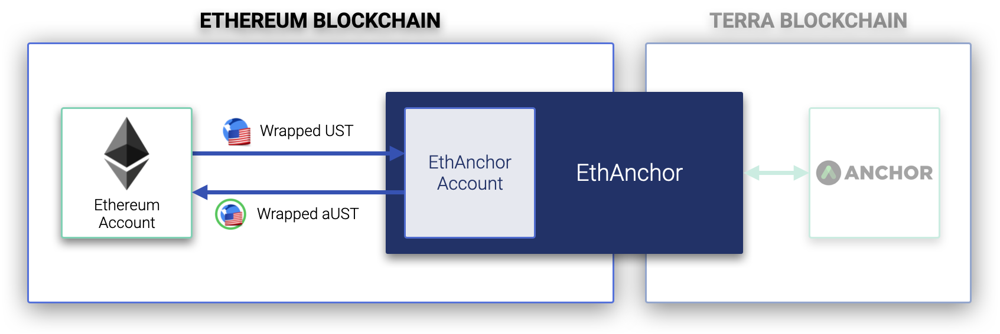

# EthAnchor


EthAnchor is currently in private beta and only supports wrapped UST. For inquiries on integrations, please contact [info@anchorprotocol.com](mailto:info@anchorprotocol.com).


**EthAnchor** provides a gateway for Ethereum users to interact with Anchor using wrapped TerraUSD \(UST\) -- a wrapped ERC20 UST token on the Ethereum blockchain.

Users can deposit wrapped UST to their [EthAnchor Account Contract](ethanchor-account-contract.md) to receive wrapped Anchor UST \(aUST\), an ERC20 aUST token on Ethereum. By holding on to wrapped aUST, users accrue the interest generated on their wrapped UST deposits.

EthAnchor is designed to be language-agnostic and provides [HTTP API endpoints](ethanchor-api/) for the fabrication of unsigned Ethereum transaction \(Tx\) payloads. Users can then sign the fabricated Tx payload with their Ethereum account key, which can then be broadcasted to the Ethereum network to conduct the desired Anchor operation.

## Components

EthAnchor largely consists of 2 components:

| Component | Description |
| :--- | :--- |
| [EthAnchorAccount Contracts](ethanchor-account-contract.md) | User-specifically generated Ethereum smart contracts that facilitate Anchor operations |
| [EthAnchor API](ethanchor-api/) | HTTP API endpoints for fabricating unsigned Ethereum Tx payloads for Anchor usage |

## Integration

#### Creating an EthAnchor Account


EthAnchor is currently in private beta. Please contact [info@anchorprotocol.com](mailto:info@anchorprotocol.com) for inquiries on integration.


In order to use EthAnchor, an EthAnchor Account contract must be first deployed. EthAnchor Account contracts are deployed based on the user's provided Ethereum address. User operations can only be made from this designated address.

#### Interacting with the EthAnchor Account Contract

Interactions with EthAnchor are processed with an `init` - `finish` architecture due to the involvement of cross-chain token transfers. It is important to note that `init` operations follow an **asynchronous model** and thus are not immediately finalized as of with a typical Ethereum contract. Additional processing time \(separate from time required for Ethereum Tx confirmation\) is needed in order for `init` requests, until which `finish` requests will result in failure.

Additionally, a single EthAnchor Account contract can only process requests in series, allowing an additional request to be made only after the finish operation for the previous request was successfully executed.

Following a successful `init` operation, the resulting wrapped tokens \(aUST for deposit, UST for redeem\) will be held by the user's EthAnchor Account contract. A `finish` operation then sends back the tokens to `msg.sender`, in which they can be potentially utilized with other Ethereum DeFi applications.

As endpoints and core logic exist on two separate blockchains, operation validity should be partially validated off-chain. In most cases EthAnchor will make appropriate RPC calls to both Ethereum and Terra to verify state on the user level, but this does not guarantee, nor enforce **automatic state integrity** for all blockchains. It is up to the **user** to resolve potential state clashes on different blockchains \(Ethereum and Terra\), and reject transactions if deemed necessary.

