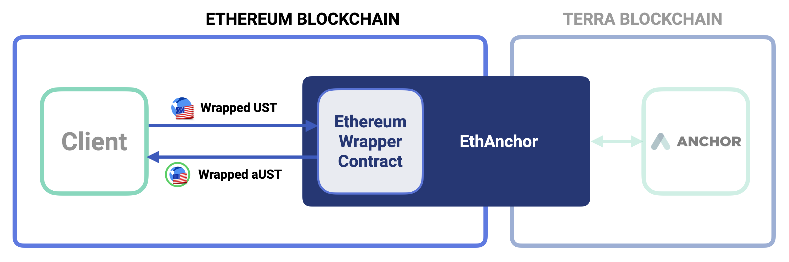

# EthAnchor


EthAnchor is currently in private beta and only supports wrapped UST deposits and redemptions. For inquiries on EthAnchor integrations, please contact [info@anchorprotocol.com](mailto:info@anchorprotocol.com)


This section outlines a brief integration guide of EthAnchor, a gateway to interact with Anchor Protocol using wrapped Terra USD \(UST\) -- a wrapped ERC20 UST token on transferred to the Ethereum blockchain.

Instead of depositing native Terra-side UST to acquire Anchor UST \(aUST\), interest-accruing proof-of-UST-deposits, clients can deposit wrapped UST to Anchor's [Ethereum Wrapper Contract](ethereum-wrapper-contract.md) to receive wrapped aUST \(ERC20 aUST token on Ethereum\). By holding on to wrapped aUST, clients can accrue the interest generated on their wrapped UST deposits.

EthAnchor is designed to be language-agnostic and uses HTTP API endpoints for the fabrication of unsigned Ethereum transaction \(Tx\) payloads. Clients can then sign the fabricated Tx payload with their Ethereum account key, which can then be broadcasted to the Ethereum network to conduct the desired Anchor operation.

## Components

EthAnchor largely consists of 2 components:

| Component | Description |
| :--- | :--- |
| [Ethereum Wrapper Contract](ethereum-wrapper-contract.md) | Ethereum-side smart contracts that facilitate client's Anchor operations |
| [HTTP API Endpoints](ethanchor-http-interface/) | Language-agnostic API endpoint for the fabrication of unsigned Anchor Tx payloads |

Integration

