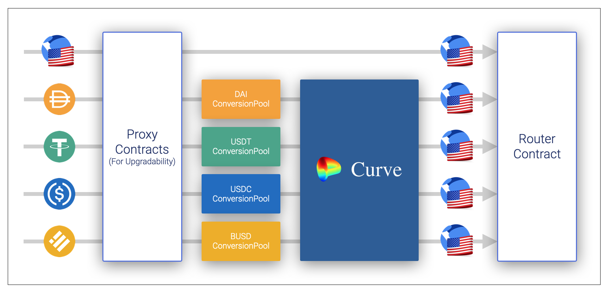

# EthAnchor Contracts

:::{danger}
EthAnchor is scheduled for deprecation and is to be replaced with xAnchor. It is highly recommended that new integrations are built with [xAnchor](../../protocol/xanchor.md) and not with EthAnchor.
:::


EthAnchor contracts are Ethereum smart contracts that facilitate cross-chain Anchor deposits. They primarily consist of [Operation](./#operation), [Router](./#router), [ConversionPool](./#conversionpool), and [ExchangeRateFeeder](./#exchangeratefeeder) contracts.

## Operation

Operation contracts are address-specifically generated smart contracts used to isolate individual EthAnchor deposit/redeem operations. They take in information about a specific request, later used to process the operation.

Operation contracts are crucial for distinguishing between operations requested by different users, and are structured to process a single request at a time.

## Router

The Router contract is responsible for routing incoming deposit/redeem operations to an available Operation contract. The Router owns multiple Operation contracts for processing user requests.


## ConversionPool

ConversionPool contracts manage the conversion between non-UST stablecoins and UST, which are subsequently deposited to Anchor through the Router.

A proxy contract lies above the Router and ConversionPool contracts for routing requests to the most recent contract version.



## ExchangeRateFeeder

The ExchangeRateFeeder contract calculates and determines the exchange rate between non-UST stablecoins and their aTerra counterparts.

```{toctree}
:hidden:
deployed-contracts
router
conversionpool
exchangeratefeeder
```