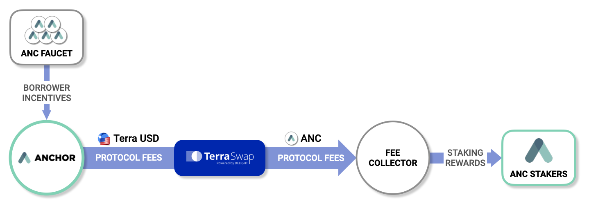
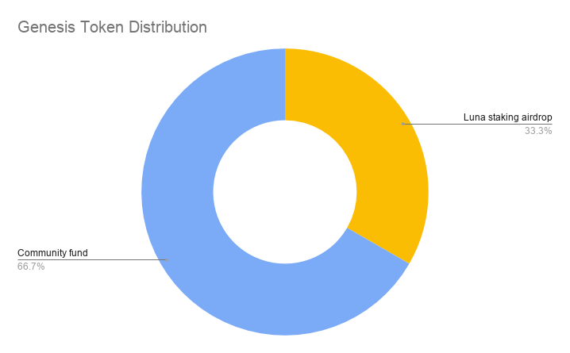
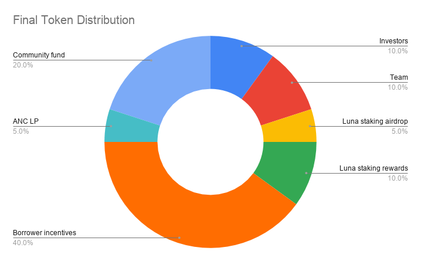

# Anchor Token \(ANC\)

The **Anchor Token** \(**ANC**\) is Anchor Protocol's governance token. ANC tokens can be deposited to create new governance polls, which can be voted on by users that have staked ANC.

ANC tokens accrue value from protocol fees, which are distributed pro-rata to ANC stakers. The ANC token is designed to benefit its stakers as adoption of Anchor Protocol increases -- stakers of ANC are incentivized to vote for proposals that further merit the protocol.

ANC is also used as incentives to bootstrap borrow demand. ANC is distributed every block to stablecoin borrowers, proportional to the amount of their accrued borrow interest.

## Value Accrual


ANC rewards can also be earned by staking LP tokens of the ANC - UST Terraswap Pair.


ANC is designed to generate a buying pressure which increases proportionally with Anchor's assets under management \(AUM\). Terra stablecoins from below sources are used to purchase ANC tokens from Terraswap, which are then distributed as staking rewards to ANC stakers.

### Protocol Fees

#### bAsset Rewards

A portion of rewards from deposited bAsset collaterals are used to purchase ANC, with the remainder used to replenish the interest buffer. The ratio of bAsset rewards used for ANC purchases can be adjusted thorough governance if the interest buffer's inventory rises to a sufficient level.

#### Collateral Liquidation Fees

Whenever a loan is liquidated, 1% of the liquidated collateral value is sent the interest buffer, which a portion of which is used to purchase ANC. This fee is applied separate from [bid premiums](liquidations.md#premium-rate).

### Governance Fees

ANC token deposits of Anchor governance polls that have failed to reach the required quorum are redistributed ANC stakers as staking rewards.

## Anchor Token Supply


The below token distribution schedules were drawn assuming the maximum borrower ANC emission rate \(`Emission Cap`\). In practice, it is highly likely that the borrower ANC distribution rate will be lower than the below distribution schedule.


There are planned to be a total of **1,000,000,000 ANC** tokens to be distributed over a period of at least 4 years. Beyond that, there will be no more new ANC tokens introduced to the supply.

### Cumulative Distribution Schedule \(in millions\)

|  | Genesis | Year 1 | Year 2 | Year 3 | Year 4 |
| :--- | :--- | :--- | :--- | :--- | :--- |
| Investors | 0 | 50 | 100 | 100 | 100 |
| Team | 0 | 25 | 50 | 75 | 100 |
| Luna Staking Airdrop | 50 | 50 | 50 | 50 | 50 |
| Luna Staking Rewards | 0 | 50 | 100 | 100 | 100 |
| Borrower Incentives | 0 | 100 | 200 | 300 | 400 |
| ANC LP Incentives | 0 | 50 | 50 | 50 | 50 |
| Community Fund | 100 | 125 | 150 | 175 | 200 |
| **Token Supply** | 150 | 450 | 700 | 850 | 1,000 |
| Annual Inflation \(%\) | nil | 200.00% | 55.56% | 21.43% | 17.65% |

### Genesis Token Distribution

A total of 150M ANC tokens are released at the genesis of Anchor Protocol. The initial distribution of ANC will be:

* **LUNA staking airdrop**: 50M \(33.3%\) tokens will be airdropped to LUNA stakers.
* **Community fund**: 100M \(66.7%\) tokens will be reserved for the Anchor Community Fund.

### Final Token Distribution

Further ANC tokens are set to be released over a period of at least 4 years. The total ANC supply increases until it reaches **1B**. The final distribution structure will be:

* **Investors**: 100M \(10%\) tokens are allocated to investors of Anchor, with a 6-month lockup period. Afterwards, a 1-year linear vesting schedule is applied.
* **Team**: 100M \(10%\) tokens are allocated to the creators of Anchor, with a 4-year vesting period. Tokens will be released at every end-of-year.
* **LUNA staking airdrop**: 50M \(5%\) tokens are airdropped to LUNA stakers.
* **LUNA staking rewards**: 100M \(10%\) tokens are linearly distributed to LUNA stakers over a period of 2 years.
* **Borrower incentives**: 400M \(40%\) tokens are linearly released to be used as borrower incentives over a period of 4 years.
* **ANC LP staking rewards**: 50M \(5%\) tokens are linearly distributed to the ANC-UST LP token staking pool over a period of 1 year.
* **Community fund**: 200M \(20%\) of all ANC tokens will be reserved for the Anchor Community Fund. On top of the 100M ANC at genesis, 100M additional tokens are linearly released to the community fund over a period of 4 years.

#### Inflation Rate

Inflation rate of ANC tokens are designed to gradually decrease every year, until it eventually reaches a supply of **1B**.

## Distribution

### Distribution to Borrowers

ANC tokens allocated for borrower incentives are gradually distributed to borrowers through the [ANC emission control algorithm](money-market/deposit-rate-subsidization.md#anc-emission-feedback-control). This is further distributed to individual borrowers pro-rata to their amount of accrued borrow interest. 

ANC incentives fuel a self-reinforcing adoption cycle, where they incentivize more borrowers to deposit bAsset collaterals, bringing further buying pressure to ANC, further increasing borrow incentives.

### Distribution to ANC Liquidity Providers

