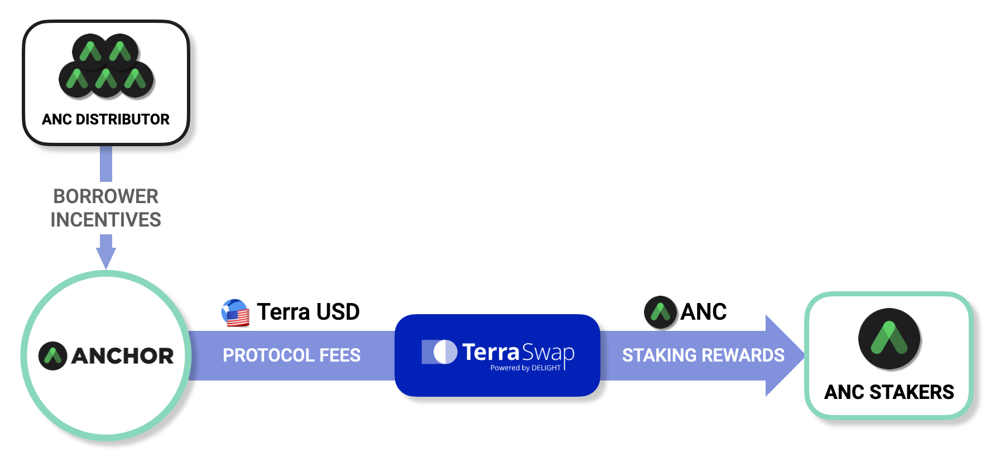

# Anchor Token \(ANC\)

The **Anchor Token** \(**ANC**\) is Anchor Protocol's governance token. ANC tokens can be deposited to create new governance polls, which can be voted on by users that have staked ANC.

ANC is designed to **capture a portion of Anchor's yield**, allowing its **value to scale linearly with Anchor's assets under management \(AUM\)**. Anchor distributes protocol fees to ANC stakers pro-rata to their stake, benefitting stakers as adoption of Anchor increases -- stakers of ANC are incentivized to propose, discuss, and vote for proposals that further merit the protocol.

ANC is also used as incentives to bootstrap borrow demand and initial deposit rate stability. The protocol distributes ANC tokens every block to stablecoin borrowers, proportional to the amount borrowed.

## Value Accrual


ANC rewards can also be earned by staking LP tokens of the ANC-UST Terraswap Pair.


ANC tokens generate a buying pressure that increases proportionally with Anchor's AUM. Protocol fees are used to purchase ANC tokens from Terraswap, which are then distributed as staking rewards to ANC stakers.

### Protocol Fees

ANC captures protocol fees generated from Anchor, where 10% of value flowing into the yield reserve used for the value accrual of ANC tokens. Anchor's protocol fees are sourced from bAsset rewards, excess yield, and collateral liquidation fees.

#### bAsset Rewards

A portion of rewards from deposited bAsset collaterals are used to purchase ANC, with the remainder used to replenish the yield reserve. The ratio of bAsset rewards used for ANC purchases can be adjusted thorough governance if the yield reserve's inventory rises to a sufficient level.

#### Excess Yield

Deposit yields in excess of the target deposit rate is accumulated to the yield reserve, with a portion used to purchase ANC. Purchased ANC tokens are then redistributed to ANC stakers.

#### Collateral Liquidation Fees

Whenever a loan is liquidated, 1% of the liquidated collateral value is sent to the yield reserve, which a portion of which is used to purchase ANC. This fee is applied separate from [bid premiums](liquidations.md#premium-rate).

### Governance Fees

ANC token deposits of Anchor governance polls that have failed to reach the required quorum are redistributed ANC stakers as staking rewards.

## Anchor Token Supply


The below token distribution schedules were drawn assuming the maximum borrower ANC emission rate \(`Emission Cap`\). In practice, it is highly likely that the rate of ANC distribution to borrowers will be lower than the values outlined in the below distribution schedule.


There are planned to be a total of **1,000,000,000 ANC** tokens to be distributed over a period of at least 4 years. Beyond that, there will be no more new ANC tokens introduced to the supply.

### Cumulative Distribution Schedule \(in millions\)

|  | Genesis | Year 1 | Year 2 | Year 3 | Year 4 |
| :--- | :--- | :--- | :--- | :--- | :--- |
| Investors | 0 | 100 | 200 | 200 | 200 |
| Team | 0 | 25 | 50 | 75 | 100 |
| Luna Staking Airdrop | 50 | 50 | 50 | 50 | 50 |
| Luna Staking Rewards | 0 | 50 | 100 | 100 | 100 |
| Borrower Incentives | 0 | 100 | 200 | 300 | 400 |
| ANC LP Incentives | 0 | 50 | 50 | 50 | 50 |
| Community Fund | 100 | 100 | 100 | 100 | 100 |
| **Token Supply** | 150 | 475 | 750 | 875 | 1,000 |
| Annual Inflation \(%\) | nil | 216.67% | 57.89% | 16.67% | 14.29% |

### Genesis Token Distribution

A total of **150M ANC** tokens are released at the genesis of Anchor Protocol. The initial distribution of ANC is given to:

* **LUNA staking airdrop**: 50M \(33.3%\) tokens will be airdropped to LUNA stakers, with staked amounts snapshotted at block **2179600**.
* **Community fund**: 100M \(66.7%\) tokens will be reserved for the Anchor Community Fund.

### Final Token Distribution

Further ANC tokens are set to be released over a period of at least 4 years, increasing total supply until it reaches **1B**. The final distribution structure will be:

* **Investors**: 200M \(20%\) tokens are allocated to investors of Anchor, with a 6-month lockup period. Afterwards, a 1-year linear vesting schedule is applied.
* **Team**: 100M \(10%\) tokens are allocated to the creators of Anchor, with a 4-year vesting period. Tokens are to be released at every end-of-year.
* **LUNA staking airdrop**: 50M \(5%\) tokens are airdropped to LUNA stakers on launch.
* **LUNA staking rewards**: 100M \(10%\) tokens are linearly distributed to LUNA stakers over a period of 2 years. Tokens will be distributed every 100,000 blocks \(approximately every week\) starting from block **2179600**. Snapshots are taken every 100,000 blocks to determine distribution eligibility.
* **Borrower incentives**: 400M \(40%\) tokens are linearly released to be used as borrower incentives over a period of 4 years.
* **ANC LP staking rewards**: 50M \(5%\) tokens are linearly distributed to the ANC-UST pair liquidity providers over a period of 1 year.
* **Community fund**: 100M \(10%\) tokens will be reserved for the Anchor Community Fund.

#### Inflation Rate

Inflation rate of ANC tokens are designed to gradually decrease every year, until it eventually reaches a supply of **1B**.

## Distribution to Ecosystem Participants

### Distribution to Borrowers

ANC tokens allocated for borrower incentives are gradually distributed to borrowers through the [ANC emission control algorithm](money-market/deposit-rate-subsidization.md#anc-emission-feedback-control). This is further distributed to individual borrowers pro-rata to their amount of accrued borrow interest. 

ANC incentives fuel a self-reinforcing adoption cycle, where they incentivize more borrowers to deposit bAsset collaterals, bringing further buying pressure to ANC, further increasing borrow incentives.

### Distribution to ANC Liquidity Providers

Since ANC tokens are used borrower incentives to stimulate initial borrow demand and deposit rate stability, high exchange liquidity for ANC is crucial for maintaining a constant incentive flow.

To incentivize initial exchange liquidity of ANC, newly minted ANC is also distributed to those that provide liquidity to ANC, specifically on the ANC-UST Terraswap pair. Tokens are given to stakers of the ANC-UST Terraswap pair LP tokens.

