# BOND \[bETH]

Minting and redeeming bETH is a cross-chain operation, requiring interactions from both the Ethereum and Terra blockchain. The below web interfaces are used to achieve certain types of actions on corresponding blockchains.

* [Lido's stETH WebApp](https://stake.lido.fi) - for minting stETH using ETH
* [Lido's bETH WebApp](https://anchor.lido.fi) - for minting and redeeming bETH using stETH
* [Anchor WebApp's BOND page](https://app.anchorprotocol.com/bond/claim) - for claiming bETH rewards
* [Terra Bridge WebApp](https://bridge.terra.money) - for transferring bETH to/from Ethereum from/to Terra
* [Curve's WebApp](https://curve.fi) - for swapping stETH for ETH

For holders of ETH, bETH can be acquired by [staking ETH](bond-beth.md#minting-beth-by-staking-eth) on [Lido's bETH WebApp](https://anchor.lido.fi/?)

Alternatively, bETH can be minted by going through stETH. This process requires the steps of: &#x20;

1. [Minting stETH by staking ETH](bond-beth.md#minting-steth-by-staking-eth) through [Lido's stETH WebApp](https://stake.lido.fi)
2. [Converting stETH to bETH](bond-beth.md#converting-steth-to-beth) via [Lido's bETH WebApp](https://anchor.lido.fi)

As for redeeming bETH tokens back to ETH, the following process can be taken:&#x20;

1. [Transferring bETH from Terra to Ethereum](bond-beth.md#1-transferring-beth-from-terra-to-ethereum) via [Terra Bridge](https://bridge.terra.money)
2. [Converting bETH to stETH](bond-beth.md#2-converting-beth-to-steth) on [Lido's bETH WebApp](https://anchor.lido.fi)
3. [Swapping stETH for ETH](bond-beth.md#swapping-steth-for-eth) on [Curve](https://curve.fi)

bETH tokens on Terra accrue rewards in TerraUSD, funded by staking rewards of Ethereum 2.0. [Accrued rewards can be claimed](bond-beth.md#claiming-accrued-beth-rewards) with the use of the [BOND page of Anchor's WebApp](https://app.anchorprotocol.com/bond/claim/).

## Connecting with Lido's web interfaces

1\. Navigate to Lido's stETH or bETH WebApp and click **\[Connect wallet]**.

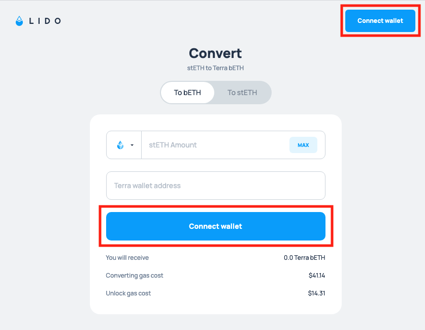

2\. Select the Ethereum wallet of choice that contains a balance of stETH / bETH and ETH.

3\. Wallet connection complete.

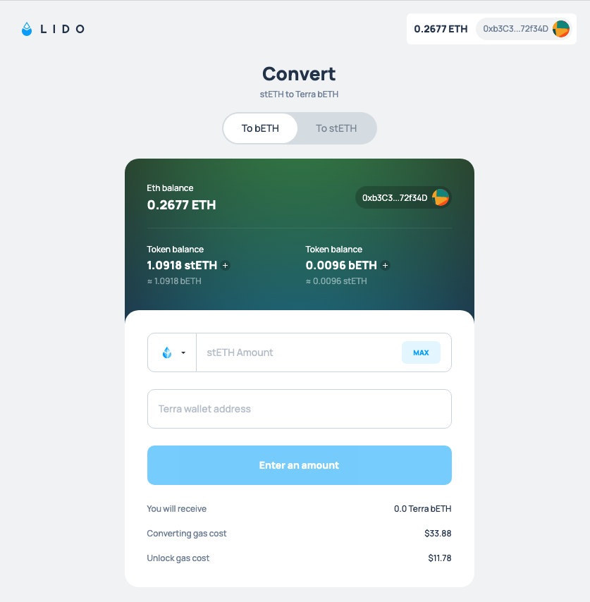

## Minting bETH by staking ETH

bETH tokens can be minted by submitting ETH to Ethereum-side bETH smart contracts. The process is achievable via Lido's bETH WebApp.

1\. Navigate to the **To bETH** page of Lido's web interface.

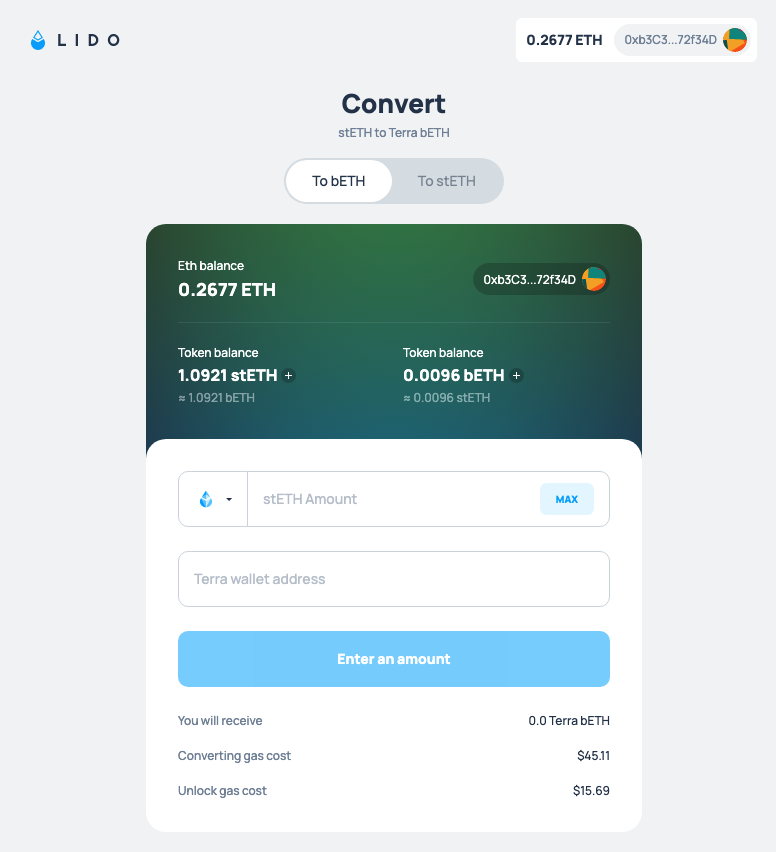

2\. Click on the dropdown and select Ethereum.

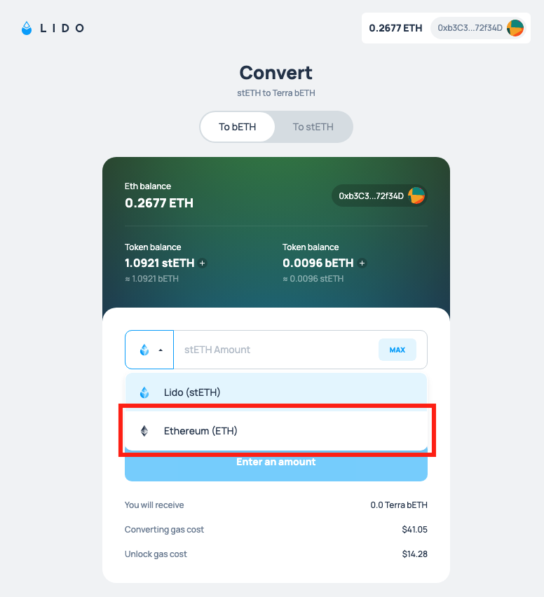

3\. Enter the amount of ETH to use in minting bETH and the Terra address to receive the resulting bETH tokens. Click **\[Convert]** to proceed.

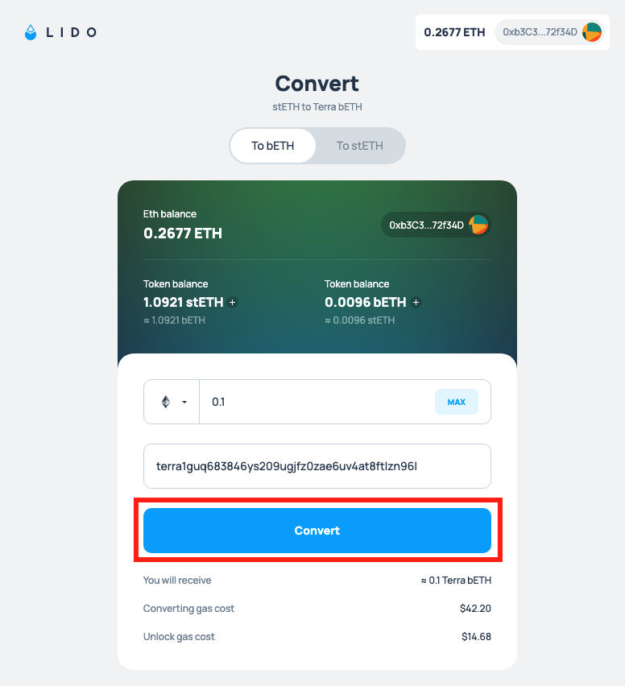

4\. Metamask should prompt you to sign a transaction that contains the mint operation. Confirm the details presented and click **\[Confirm]** to sign.

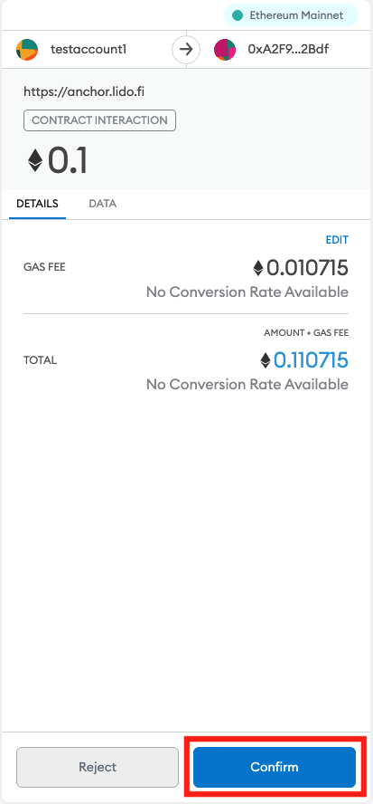

5\. Mint complete. After the transaction is processed by Shuttle, the specified Terra address will now hold an increased balance of bETH tokens.

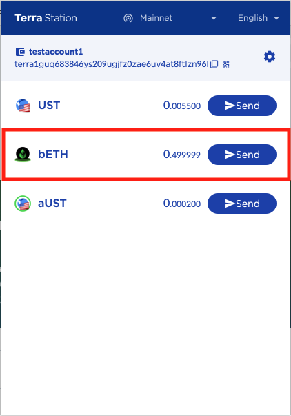

## Minting stETH by staking ETH

bETH tokens are backed by Lido's stETH tokens. stETH can be created by staking ETH via Lido's stETH smart contracts, which can be accessed through Lido's stETH WebApp.&#x20;

1\. Navigate to the **STAKE** page of Lido's web interface.

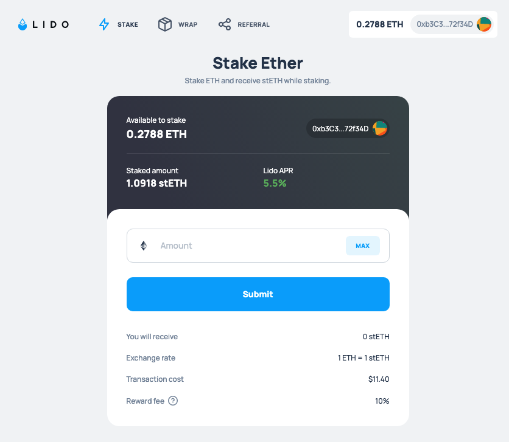

2\. Enter the amount of ETH to stake and use in minting stETH. Click **\[Submit]** to proceed.

3\. Metamask should prompt you to sign a transaction that contains the stake operation. Confirm the details presented and click **\[Confirm]** to sign.&#x20;

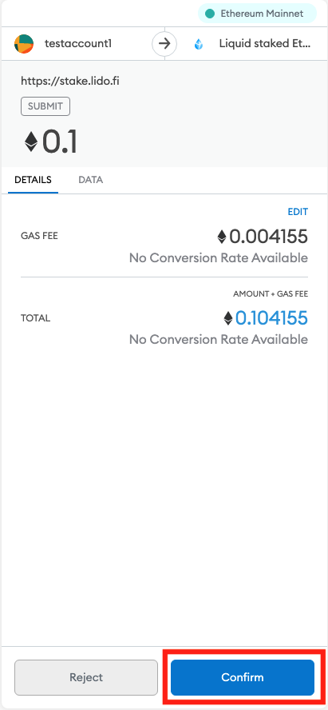

4\. Staking complete.

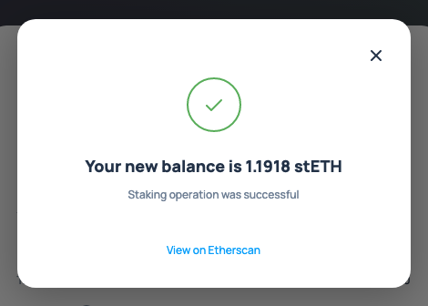

## Converting stETH to bETH


Unlike bLuna, bETH tokens are minted / redeemed through [Lido's web interface for bETH](https://anchor.lido.fi).


1\. Navigate to the **To bETH** tab in the **Convert** page.

.png>)

2\. Enter the amount of stETH to use in minting bETH and click the **\[Unlock token for conversion]** button to confirm. This process authorizes Lido's web interfaces to interact with you stETH tokens.

.png>)

3\. Metamask should prompt you to sign a transaction that contains the authorize operation. Confirm the details presented and click **\[Confirm]** to sign.

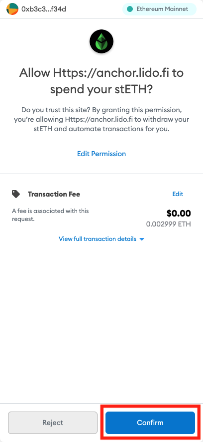

4\. Enter the Terra address to receive the resulting bETH tokens. Click **\[Convert]** to proceed.

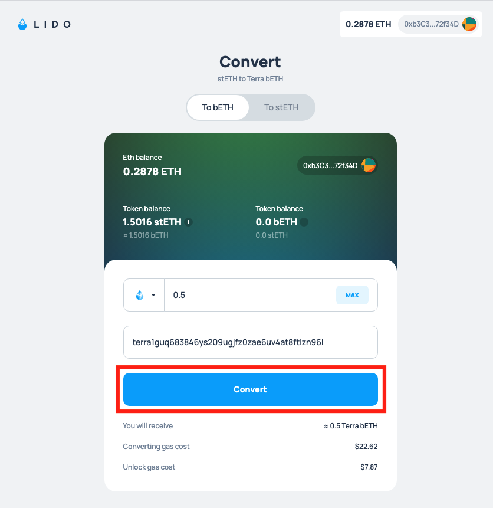

5\. Metamask should prompt you to sign a transaction that contains the convert operation. Confirm the details presented and enter your password to sign.

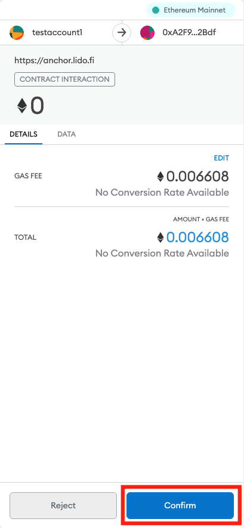

6\. Conversion complete. After the transaction is processed by Shuttle, the specified Terra address will now hold an increased balance of bETH tokens.

## Redeeming bETH to stETH

bETH tokens that reside on the Terra blockchain should be first transferred to Ethereum before they can be redeemed for stETH.

Redemption is a two-step process, first requiring a cross-chain transfer, which is the followed by a redemption to stETH.

### 1. Transferring bETH from Terra to Ethereum


Shuttle applies a fee of **0.1%** (with a minimum fee of 1 UST) for Terra to Ethereum transfers. Transfer requests below a transfer value of 1 UST are ignored.


Cross-chain transfers between Ethereum / Terra can be achieved through Terra Bridge.

1-a. Navigate to Terra Bridge.

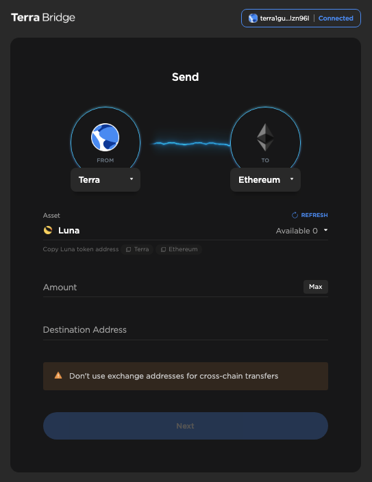

1-b. Select bETH as the asset to Transfer. Specify the amount to transfer, as well as the Ethereum address to receive transferred bETH tokens.

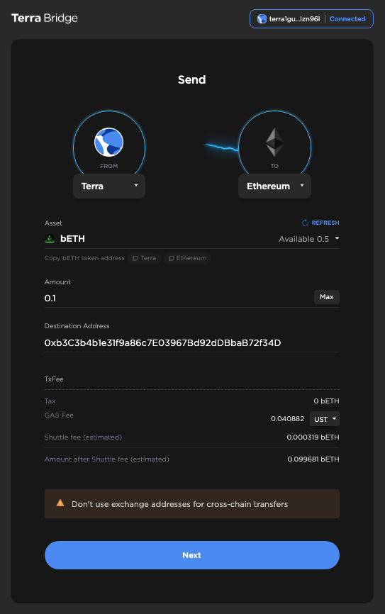

1-c. Click **\[Confirm]** to proceed.

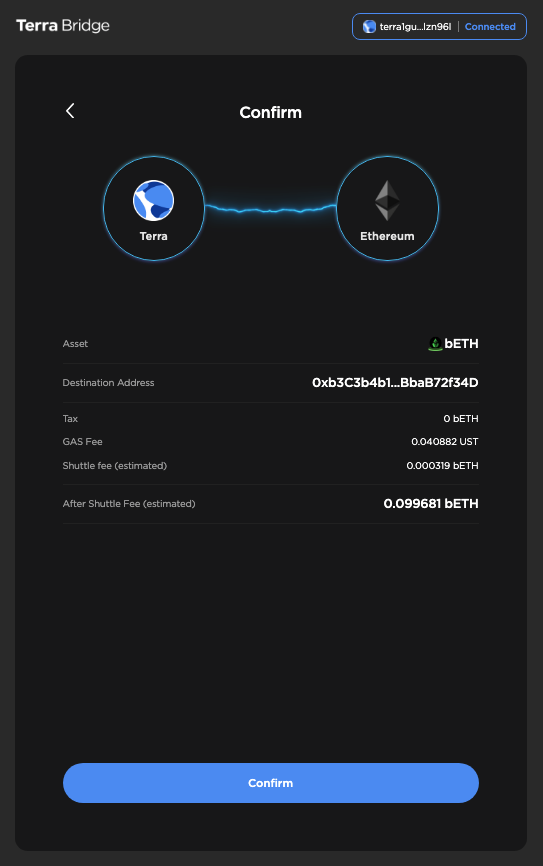

1-d. Station Extension should prompt you to sign a transaction that contains the mint operation. Confirm the details presented and enter your password to sign.

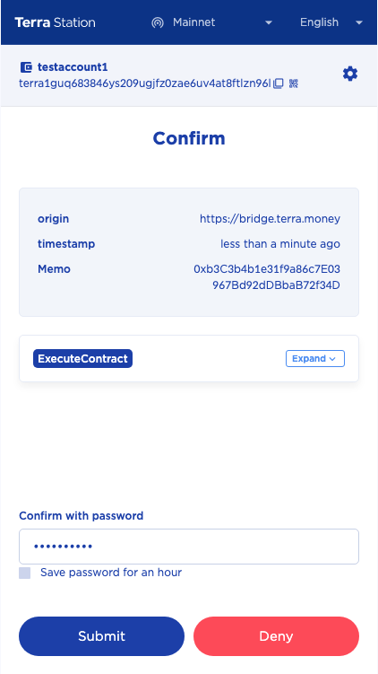

1-e. Transfer complete.

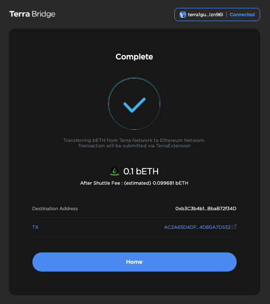

After the transaction is processed by Shuttle, the specified Ethereum address should now include a balance of bETH.

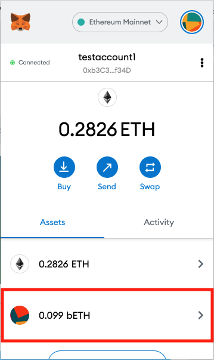

### 2. Converting bETH to stETH

2-a. Navigate to the **To stETH** tab in the **Convert** page.

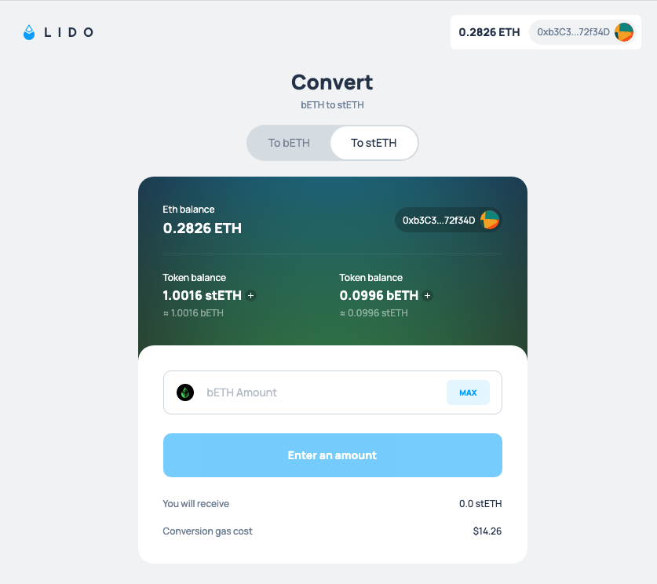

2-b. Enter the amount of bETH to convert to stETH and click the **\[Transfer]** button to proceed.

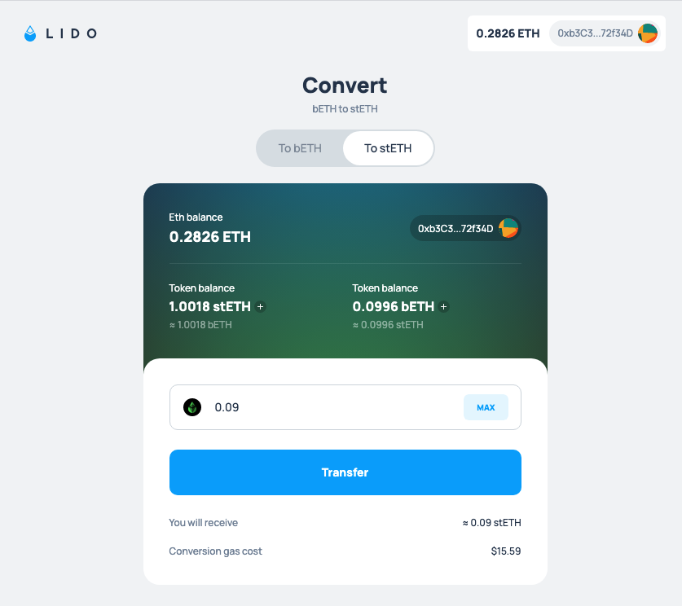

2-c. Metamask should prompt you to sign a transaction that contains the conversion operation. Confirm the details presented and click **\[Confirm]** to sign.

2-d. Conversion complete.

## Swapping stETH for ETH

1\. Navigate to Curve Finance's web interface, [curve.fi](https://curve.fi).

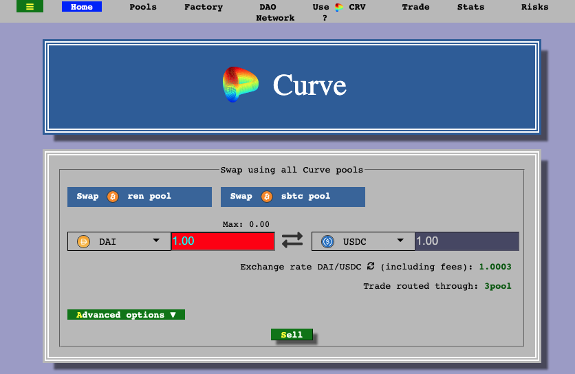

2\. Select STETH and ETH. Enter the amount of stETH to swap for ETH and click **\[Sell]** to proceed.

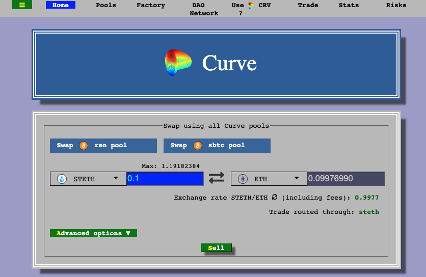

3\. Metamask should prompt you to sign a first transaction that contains an authorization for Curve's web interface to interact with your stETH tokens. Confirm the details presented and click **\[Confirm]** to sign.

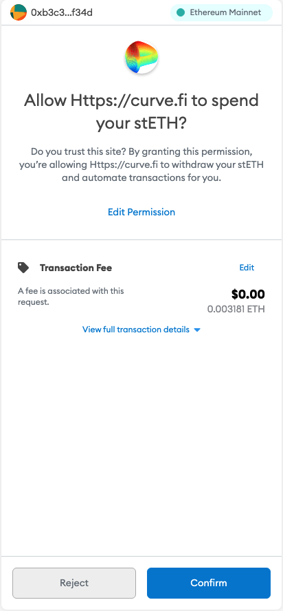

4\. Metamask should then prompt you to sign a second transaction that contains the swap operation. Confirm the details presented and click **\[Confirm]** to sign.

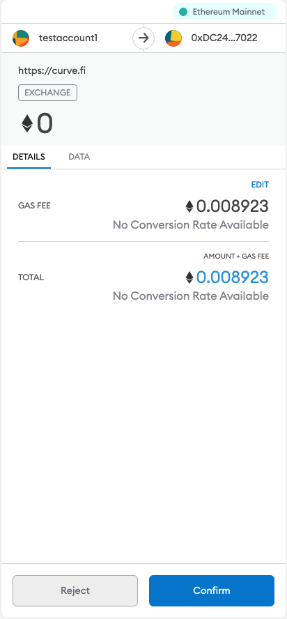

5\. Swap complete.

## Claiming accrued bETH rewards


bETH rewards only accrue only if the user is currently holding bETH tokens. Users do not accrue rewards from bETH tokens deposited to Anchor.


1\. Navigate to the **CLAIM** tab in the **BOND** page.

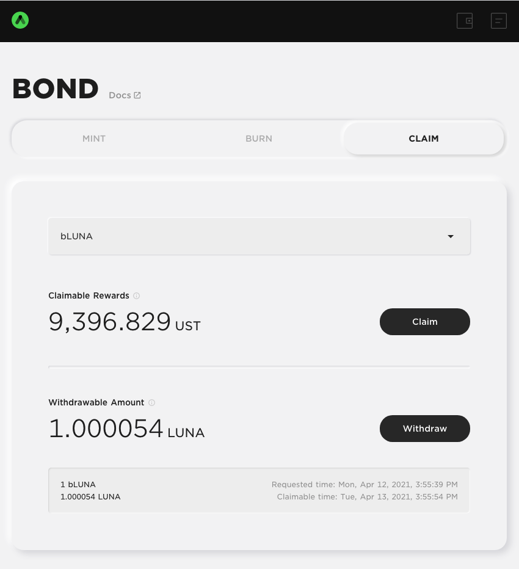

2\. Select bETH in the dropdown.

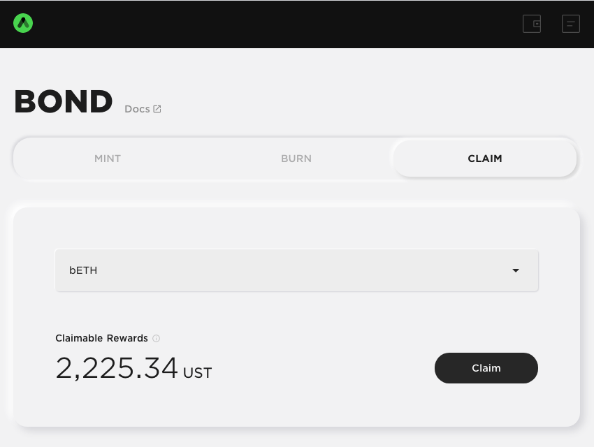

3\. Check the amount of accrued bETH rewards (**Claimable Rewards**). Click the **\[Claim]** button to claim accrued rewards.

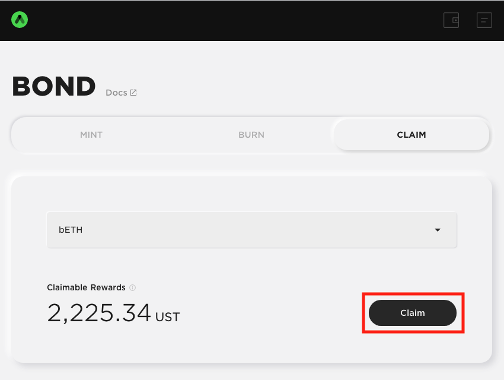

4\. Station Extension should prompt you to sign a transaction that contains the reward claim operation. Confirm the details presented and enter your password to sign.

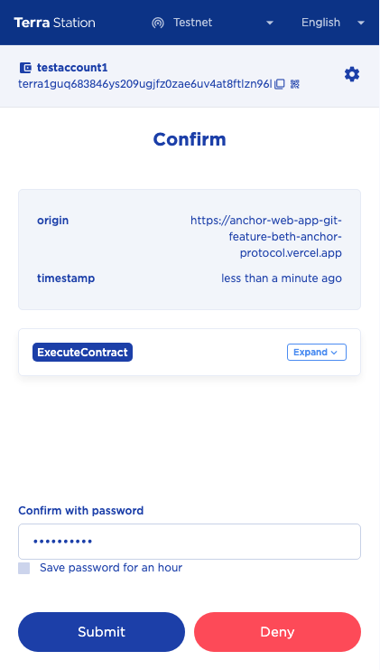

5\. Reward claim complete.

.png>)
