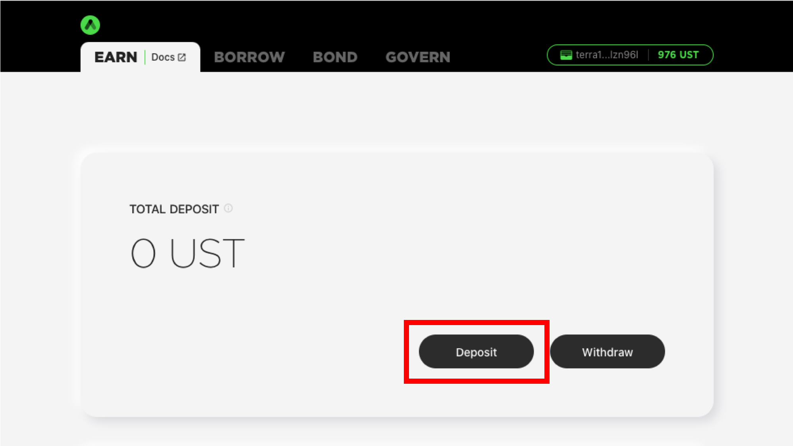
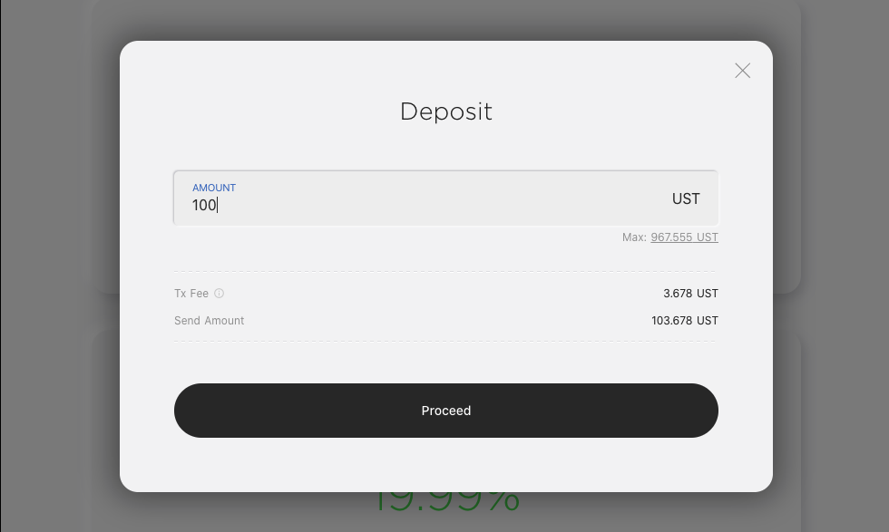
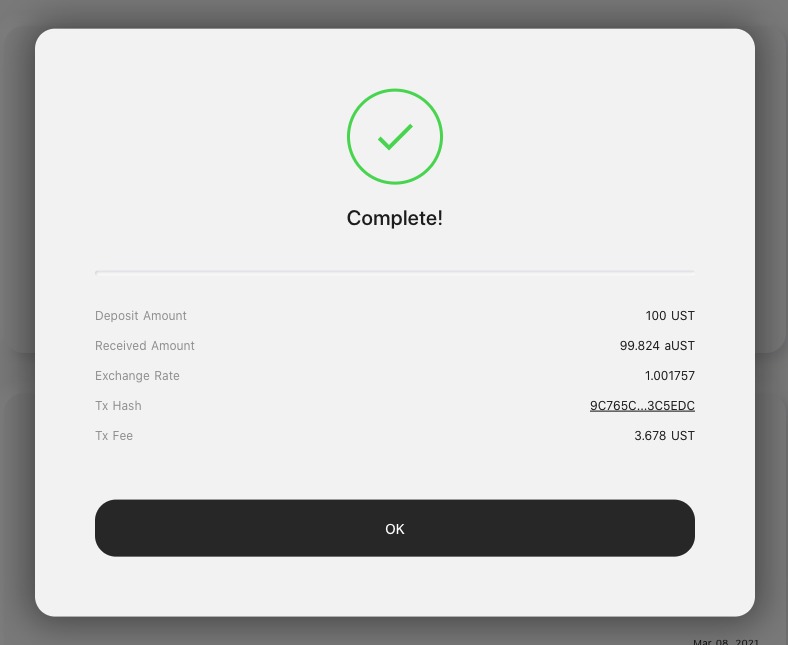
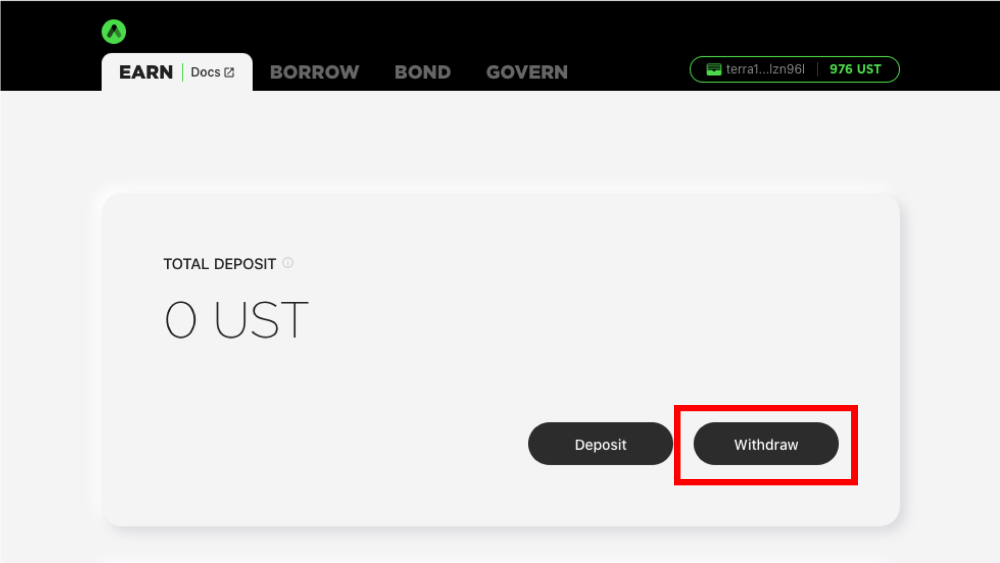
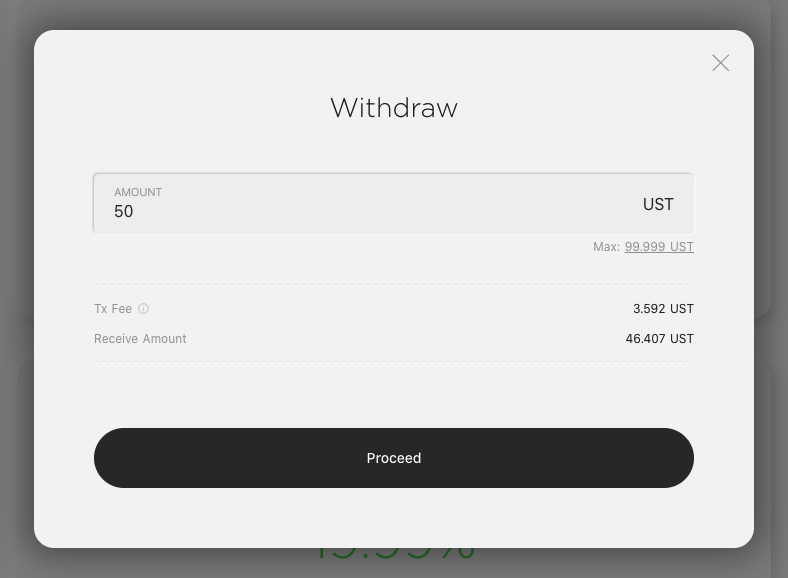
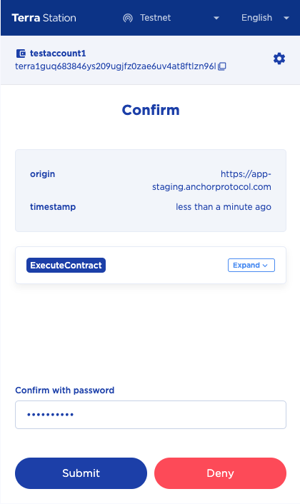
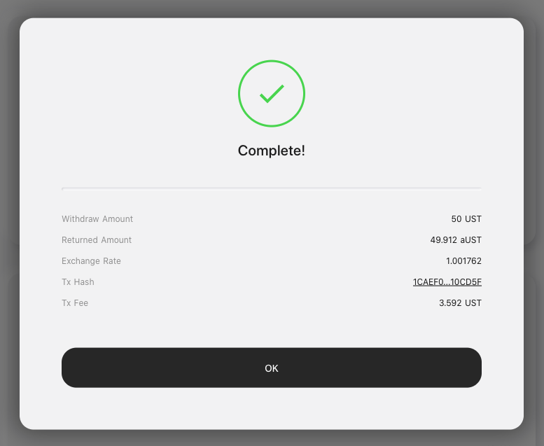

# EARN

The **EARN** page provides a savings account interface to earn Anchor yield on Terra stablecoins. It allows users to deposit and withdraw Terra stablecoins, track their current deposit value, history of transactions, current deposit annualized percentage rate \(APY\), and amount of interest earned from Anchor.


As of March 17th, 2021, Anchor only supports TerraUSD \(UST\) as the base currency. Other Terra stablecoins will be supported as UST pairs become more liquid.


The **EARN** page displays the following data:

* **Total Deposit**: UST value of user's deposit. Includes accrued deposit interest. 
* **Transaction History**: History of user's deposit & withdraw interactions. Displays the deposit / withdraw amount, sender / recipient, and transaction time. 
* **Interest**: Display data related to deposit interest.
  * **APY**: Current deposit APY.
  * **APY Graph**: Historical graph of deposit APY.
  * **Interest Earned**: Amount of deposit interest earned during the selected time period.

## Depositing Terra stablecoins

1. Navigate to the **EARN** page and click the **\[Deposit\]** button. 

2. Enter the amount of stablecoins to deposit and click the **\[Proceed\]** button to confirm.

3. Station Extension should prompt you to sign a transaction that contains the deposit operation. Confirm the details presented and enter your password to sign.

4. Deposit complete.

## Withdrawing Terra stablecoins

1. Navigate to the **EARN** page and click the **\[Withdraw\]** button. 

2. Enter the withdraw amount and click the **\[Proceed\]** button to confirm.

3. Station Extension should prompt you to sign a transaction that contains the withdraw operation. Confirm the details presented and enter your password to sign.

4. Withdraw complete.

